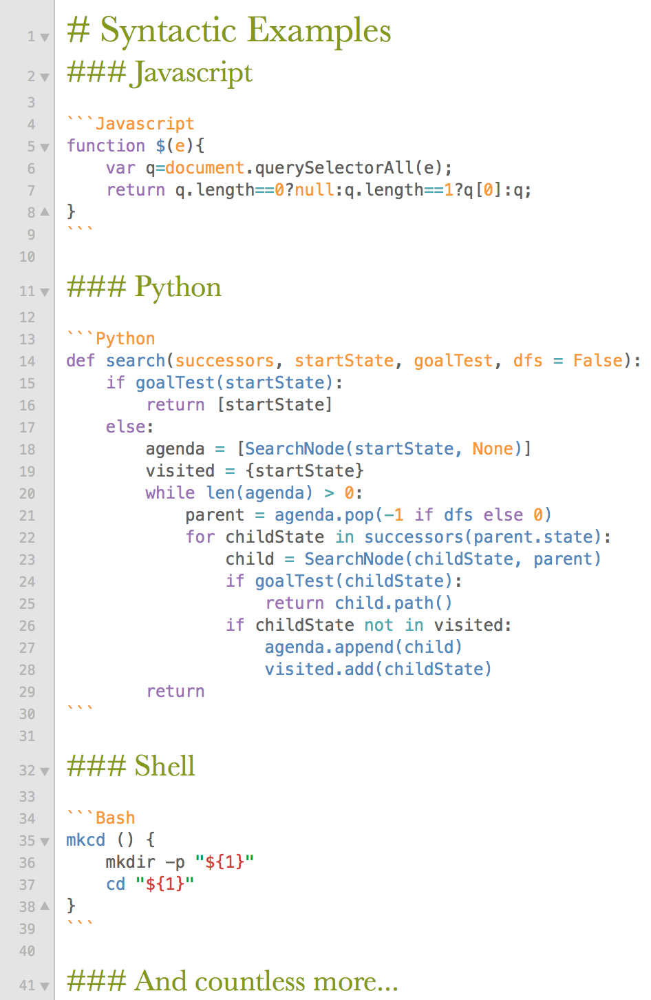

# Markdown (GitHub)

A TextMate Bundle with a language grammar "Markdown (GitHub)" with syntax highlighting in fenced blocks of major GitHub-flavored markdown approved languages: 

+ AppleScript
+ Bash
+ C
+ C++
+ CSS
+ HTML
+ Java
+ Javascript
+ JSON
+ LaTeX
+ Markdown
+ Mathematica
+ Matlab
+ Objective-C
+ Objective-C++
+ Perl
+ PHP
+ PostScript
+ Python
+ R
+ Ruby
+ Scala
+ SQL
+ Swift
+ TeX
+ XML

Use the convient `code` snippet to initiatiate a fenced block with these languages!

Syntax highlighting requires that you already have the corresponding language grammar installed.

###Installation:

Download the ZIP repository, rename the unzipped folder removing '-master', and use the .tmbundle extension
